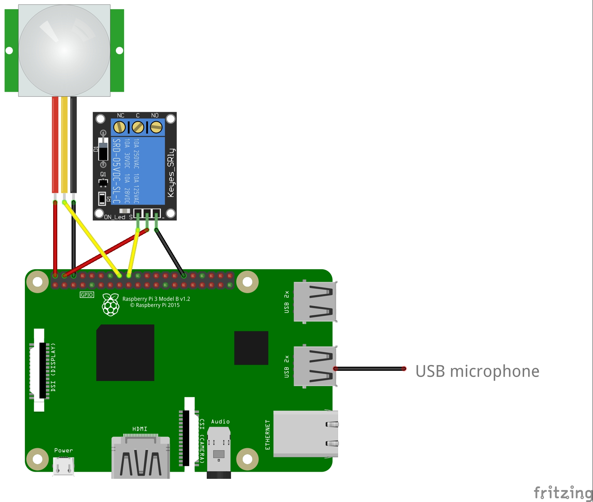

# Raspberry pi smart mirror

## Widgets

### Clock widget

- Displays time-related information using python's datetime module

### Weather widget

- Displays weather-related information using python's weather-api module

### Temperature widget

- Displays temperature and humidity from my ethernet arduino thermometer ([available here](github.com/somethingsomething))

### Assistant widget

- Conversation with the Google Assistant (combined google's sample and kivy StackLayout)

## Required python packages

- [RPi.GPIO](https://pypi.org/project/RPi.GPIO/)
- [kivy](https://kivy.org/docs/installation/installation-rpi.html)
- [weather-api](https://pypi.org/project/weather-api/)
- [httplib2](https://pypi.org/project/httplib2/)

## Google assistant installation

- Please follow instructions in the 'Embed the Google Assistant' section [available here](https://developers.google.com/assistant/sdk/guides/library/python/embed/setup)

## Raspberry pi connections

USB microphone (or 3.5 mm microphone with an USB sound card)

| PIR sensor | Raspberry pi |
| ---------- | ------------ |
| VCC        | 5V           |
| OUT        | BCM 23       |
| GND        | GND          |

| Relay | Raspberry pi |
| ----- | ------------ |
| VCC   | 5V           |
| VIN   | BCM 24       |
| GND   | GND          |

BCM pins can be configured in the 'config.json' file

# Example schematic

